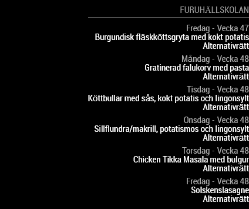

# MMM-Skolmaten

A [MagicMirror²](https://github.com/MagicMirrorOrg/MagicMirror) module that shows school lunch menus in Sweden from <www.skolmaten.se>.



## Installation

1. Clone repo:

```bash
 cd MagicMirror/modules/
 git clone https://github.com/retroflex/MMM-Skolmaten
```

2. Install dependencies:

```bash
 cd MMM-Skolmaten/
 npm install
```

3. Add the module to the ../MagicMirror/config/config.js, example:

```javascript
  {
   module: 'MMM-Skolmaten',
   header: 'Furuhällskolan',
   position: 'bottom_right',
   config: {
    url: 'https://skolmaten.se/furuhallskolan/rss/'
   }
  },
```

## Configuration

Using the <https://skolmaten.se/furuhallskolan/rss/> URL will show lunch for the next seven days (including today).

You can choose how many days should be shown by using another URL, although I haven't tested that. More info here:
<https://skolmaten.se/about/rss/furuhallskolan/>

## Details

This module simply shows an RSS feed, with some limitations (which are not a problem with skolmaten.se):

1. Hard coded to update RSS feed once an hour.
2. Always shows all entries in the RSS feed.
3. Hard coded in Swedish.

I still wanted to keep this as a separate module instead of a generic RSS module, too keep things simple and allow for future specific features.

## To Do

Handle invalid URL's.
